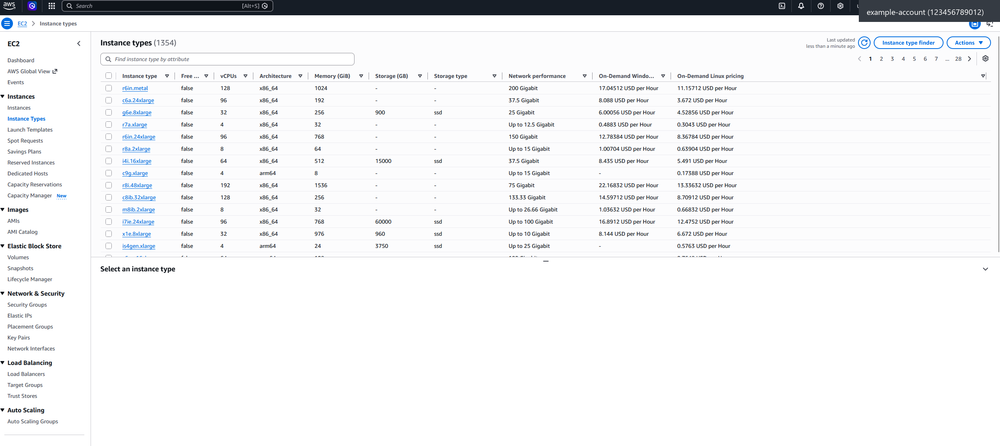
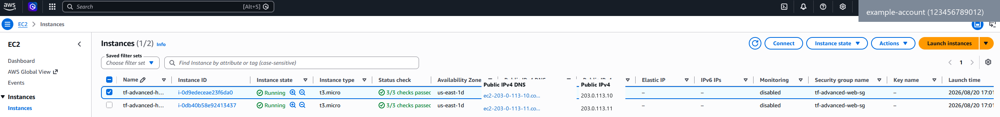
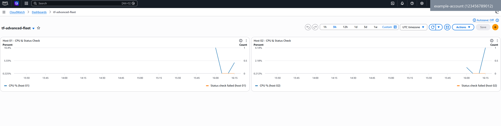
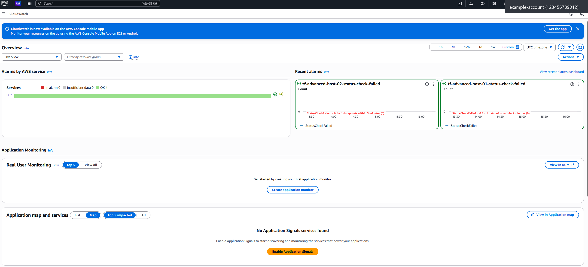
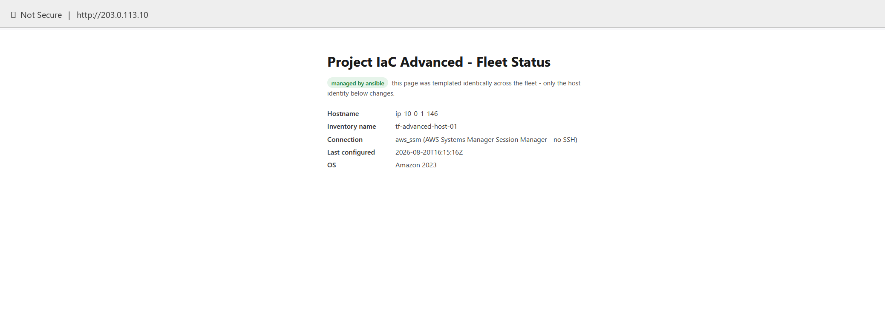

# Terraform + AWS Advanced Project

**Licence:** [MIT](LICENSE.md) — free to use, modify, and distribute, including
commercially. Provided as-is, without warranty; the author accepts no liability
for any AWS charges, data loss, or other costs you incur using it.

> [!WARNING]
> **Lab / learning project only — not production-ready.** Everything here is built for short-lived lab testing in a personal AWS account and torn down at the end of each session. Several choices are deliberately simplified for learning and cost, and are **not** safe defaults to copy into a real environment. In particular:
> - The hosts sit in a **public subnet** and serve a demo page over **plain HTTP (port 80, no TLS) to the whole internet**.
> - One shared IAM role covers the whole fleet, and the data bucket uses `force_destroy = true`.
> - The optional AD demo is a throwaway directory for a screenshot, with its admin password supplied by hand.
>
> Use it to learn from, and review and harden it before reusing any part of it. See [What to learn next](#what-to-learn-next) for what a production version would change.

A staged, multi-host AWS environment built with Terraform, Ansible, and PowerShell — the advanced companion to the `Project-IaC` learning project. Where that project builds one server, this one builds and operates a small **fleet**: multiple EC2 hosts behind a reusable Terraform module, CloudWatch monitoring, Ansible configuration management over SSM (no SSH keys), a periodic telemetry-to-S3 pipeline, and a locally-run PowerShell health-report script. A separate, isolated component briefly stands up a real AWS Managed Microsoft AD directory for a portfolio screenshot.

The telemetry pipeline (Stage 4) is deliberately modelled on a common OT/industrial pattern: small, scheduled payloads captured from remote assets and shipped into one centralised, lifecycle-managed data store — here, host health metrics standing in for field-device readings, and an S3 bucket standing in for a data historian.

## Project structure

| Directory | Purpose | State |
|---|---|---|
| `bootstrap/` | Stage 0 — creates the S3 bucket (and reference DynamoDB table) the rest of the project stores its state in | Local, permanent |
| `.` (root) | Stages 1–2 — VPC, host fleet, IAM, CloudWatch monitoring | Remote (S3, native locking) |
| `modules/host/` | Reusable single-host module called by the root config | N/A (module, no state of its own) |
| `ansible/` | Stage 3–4 — configuration management and the telemetry pipeline, run against the fleet over SSM | N/A (no Terraform state; Ansible has none) |
| `scripts/` | `Get-FleetHealth.ps1` — local PowerShell fleet health report | N/A |
| `ad-demo/` | Optional, fully isolated — AWS Managed Microsoft AD for a portfolio screenshot | Remote (same S3 bucket, separate key) |

## What this project builds

| Resource | Purpose | Built by |
|---|---|---|
| S3 state bucket + DynamoDB lock table (reference) | Remote backend for the rest of the project's Terraform state | `bootstrap/` |
| VPC `10.0.0.0/16` + public subnet `10.0.1.0/24` | Isolated network the fleet lives in — no NAT Gateway, by design | `network.tf` |
| Internet Gateway + route table | Makes the subnet public | `network.tf` |
| Security group | HTTP (80) from anywhere — **lab demo only**, plain HTTP with no TLS; SSH (22) only if `ssh_allowed_cidr` is set (default: closed) | `network.tf` |
| `host_count` EC2 hosts (default 2, 1–5) | Amazon Linux 2023 fleet, provisioned via a reusable module | `hosts.tf` + `modules/host/` |
| Shared IAM role + instance profile | Lets every host read/write one S3 bucket and use SSM Session Manager — no keys | `iam.tf` |
| Private S3 data bucket, `telemetry/` prefix, 30-day lifecycle rule | The "centralised data library" the fleet reports into | `storage.tf` |
| CloudWatch alarms (status-check + CPU, per host) + fleet dashboard | Health monitoring | `monitoring.tf` |
| Ansible baseline + telemetry playbook | Patching, nginx, hardening, and the scheduled S3 upload — all over SSM | `ansible/` |
| `Get-FleetHealth.ps1` | Local fleet health report (EC2 + SSM + CloudWatch), console table or HTML/CSV export | `scripts/` |
| AWS Managed Microsoft AD (Standard) in its own VPC `10.99.0.0/16` | Portfolio screenshot only — isolated, not part of the running architecture | `ad-demo/` |

## What each stage builds

Stages 1 and 2 live in the **same root Terraform configuration** and are built by a single `terraform apply` — they're described as separate stages here because each adds a distinct capability, not because you apply them separately. Stage 0 and `ad-demo/` are genuinely separate Terraform configurations with their own state. Stages 3–4 are Ansible, run against whatever fleet the root apply already built.

| Stage | Adds | Applied from | Destroy independently? |
|---|---|---|---|
| 0 — Remote state bootstrap | S3 state bucket, reference DynamoDB lock table | `bootstrap/` | No — this is the one thing you *don't* destroy each session |
| 1 — Multi-host fleet | VPC, subnet, security group, IAM role, data bucket, `host_count` EC2 hosts | project root | Yes (`terraform destroy` from root) |
| 2 — SSM + CloudWatch monitoring | Managed-instance SSM access, per-host alarms, fleet dashboard | project root (same apply as Stage 1) | Yes (same as above) |
| 3 — Ansible configuration management | Patching, nginx, light SSH hardening, dynamic SSM inventory | `ansible/` (`--tags baseline`) | N/A — no state; re-running just re-converges |
| 4 — S3 telemetry pipeline | Scheduled host-health snapshots shipped to `telemetry/` in the data bucket | `ansible/` (`--tags telemetry`) | N/A — stops once the host is destroyed |
| Optional — AD demo | AWS Managed Microsoft AD, own VPC, own state key | `ad-demo/` | Yes, and you should — see the warning below |

## Prerequisites

Everything from the base `Project-IaC` project's prerequisites (AWS account, IAM user, budget alert, AWS CLI, Terraform), plus:

| Requirement | Why | Install |
|---|---|---|
| Terraform **≥ 1.10.0** | `backend.hcl` uses `use_lockfile = true` — native S3 state locking, a Terraform 1.10 feature. Older versions don't understand the argument. | `winget install Hashicorp.Terraform`, then `terraform version` to confirm |
| AWS Session Manager plugin (Windows) | The `aws ssm start-session` CLI command, run from a plain Windows PowerShell/CLI session, shells out to this local binary. | `winget install -e --id Amazon.SessionManagerPlugin` |
| AWS Session Manager plugin (WSL, separate install) | The Windows plugin above only satisfies `aws ssm start-session` run *from Windows*. Ansible's `amazon.aws.aws_ssm` connection plugin runs inside WSL's own Linux environment and needs its own Linux build of the same plugin — without it, `ansible-playbook` fails immediately on `Gathering Facts` with `Failed to find required executable "session-manager-plugin"`. | Inside WSL: `curl "https://s3.amazonaws.com/session-manager-downloads/plugin/latest/ubuntu_64bit/session-manager-plugin.deb" -o session-manager-plugin.deb && sudo dpkg -i session-manager-plugin.deb` |
| Python 3 + `boto3`/`botocore` | Required by the `amazon.aws` Ansible collection (dynamic inventory and the `aws_ssm` connection plugin are both Python underneath). | `winget install Python.Python.3.12`, then `pip install boto3 botocore` |
| Ansible (`ansible-core`) | Runs the Stage 3–4 playbook. **Ansible does not support Windows as a control node** — run it from WSL, a Linux VM, or macOS, not directly from PowerShell. | Inside WSL/Linux: `pip install ansible-core` (or your distro's package) |
| AWS credentials inside WSL | WSL runs its own Linux environment with its own `~/.aws/`, entirely separate from Windows' `%USERPROFILE%\.aws\`. boto3/Ansible running inside WSL won't see Windows-side AWS CLI credentials automatically — `ansible-inventory`/`ansible-playbook` fail with `Unable to locate credentials` even though `aws sts get-caller-identity` works fine in a plain Windows PowerShell session. | Copy your Windows credentials/config into WSL's own store, e.g. `mkdir -p ~/.aws && cp /mnt/c/Users/<you>/.aws/{credentials,config} ~/.aws/` |
| PowerShell AWS Tools modules | `Get-FleetHealth.ps1` needs `AWS.Tools.EC2`, `AWS.Tools.SimpleSystemsManagement`, `AWS.Tools.CloudWatch`, and `AWS.Tools.SecurityToken` (used by `Get-STSCallerIdentity`) — all four are declared in the script's `#Requires` header, so it refuses to start if any are missing | `Install-Module -Name AWS.Tools.Installer -Scope CurrentUser`, then `Install-AWSToolsModule AWS.Tools.EC2,AWS.Tools.SimpleSystemsManagement,AWS.Tools.CloudWatch,AWS.Tools.SecurityToken -CleanUp` |

## Cost guardrails — read before applying anything

This account is on AWS's post-July-2025 **credit-based Free Plan**, not the classic 750-hour-per-service pool. Running more hosts burns the credit balance roughly in proportion to `host_count` — "free-tier eligible" instance types aren't free just because several of them are running at once.

| Line item | Reality |
|---|---|
| Every public IPv4 address | ~£0.004/hr (approx.) since Feb 2024, free-tier eligible or not. `host_count` directly multiplies this — small, but real. At the default `host_count = 2` that's ~£0.008/hr; at the maximum of 5 it's ~£0.02/hr. |
| EBS storage | The 30 GB/month free allowance is **account-wide**, shared with anything else running in the account. Default is `host_count (2) × root_volume_gb (8) = 16 GB` — comfortable headroom, but the math is yours to keep an eye on if you raise either value. |
| CloudWatch alarms | 2 per host. The Always-Free ceiling is 10/account. `host_count` is capped at 5 by validation (5 × 2 = 10 — exactly the ceiling), so this project alone can't push you over it. If you have *other* alarms already in the account, the combined total can still exceed 10 even at `host_count ≤ 5`. |
| AWS Managed Microsoft AD (`ad-demo/`) | See the dedicated warning further down — this is the expensive one. |


*EC2 → Instance Types — 1,354 options, most of them wildly wrong for a two-host portfolio fleet. `t3.micro` is the deliberate, boring choice out of this whole list.*

**Same discipline as the base project: destroy everything except the Stage 0 bootstrap at the end of every session.**

```powershell
# from the project root
terraform destroy

# ad-demo/, if you applied it — do this the SAME session, right after your screenshot
cd ad-demo
terraform destroy
```

## Stage 0 — Remote state bootstrap

`bootstrap/` is a small, standalone Terraform config that creates the S3 bucket the root project (and `ad-demo/`) store their state in. It's applied once, ever — not part of the destroy-every-session cycle.

**Why it can't use the same remote backend it creates**: this is the classic chicken-and-egg problem. The root project's state lives in an S3 bucket, but *something* has to create that bucket before Terraform can point a backend at it. `bootstrap/` breaks the cycle by keeping its own state **locally** (`bootstrap/terraform.tfstate`, gitignored) permanently — there's no bucket for it to migrate into without creating a second chicken-and-egg problem one level up.

```powershell
cd bootstrap
terraform init
terraform apply
terraform output state_bucket_name
```

`bootstrap/main.tf` creates two things:

- An **S3 bucket** (versioned, SSE-S3 encrypted, all public access blocked) — this is what actually holds the root project's and `ad-demo/`'s state files, at different keys within the same bucket.
- A **DynamoDB table**, included for reference only. This is the "classic" Terraform locking pattern — a DynamoDB table used to hold a lock item while an apply is in progress, the standard approach for years and still what you'll find in most existing Terraform codebases. This project's actual configs (root and `ad-demo/`) don't use it: they use Terraform's **native S3 locking** instead (`use_lockfile = true` in `backend.hcl`, a conditional-write lock file living inside the state bucket itself, requires Terraform ≥ 1.10). Both patterns solve the same problem — preventing two people or processes from writing state at the same time — the DynamoDB table is kept here purely so the pattern is visible in the repo.

## Stage 1 — Multi-host fleet, module, and remote state

**Initialize against the remote backend.** Because `backend.tf` declares an intentionally empty `s3` backend block ("partial configuration"), the real bucket name — which includes a random suffix and is different for every AWS account — is supplied separately at init time rather than hardcoded into a committed file:

```powershell
cd ..   # back to the project root
Copy-Item backend.hcl.example backend.hcl
notepad backend.hcl   # paste in the state_bucket_name from Stage 0's output
terraform init -backend-config=backend.hcl
```

`backend.hcl` also sets `use_lockfile = true` — this is what turns on native S3 state locking; no DynamoDB table is referenced from here.

**The fleet itself** is provisioned by `hosts.tf`, which decides *how many* hosts to create and *what's unique* about each one, and delegates the actual EC2 resource to `modules/host/`, which knows nothing about the rest of the project — it just launches one instance from whatever inputs it's given.

| `modules/host` input | Where it comes from |
|---|---|
| `ami_id` | AMI data source lookup in `hosts.tf` (latest Amazon Linux 2023) |
| `instance_type`, `root_volume_gb` | Root `variables.tf` |
| `subnet_id`, `security_group_ids`, `iam_instance_profile` | Shared resources from `network.tf` / `iam.tf` |
| `key_name` | `key_pair_name` variable (optional, `null` by default) |
| `user_data` | `templatefile()` over `user_data.sh.tpl`, with a per-host `host_key` |
| `name_tag` | `"${project_name}-host-${host_key}"` |

| `modules/host` output | Used for |
|---|---|
| `instance_id` | CloudWatch alarm dimensions, `host_instance_ids` output, SSM targeting |
| `public_ip` | `host_public_ips` output, SSH command construction |
| `private_ip` | Available if you ever need it (not currently used elsewhere) |

`for_each` (over `toset(local.host_keys)` — string keys like `"01"`, `"02"`, not numeric indexes) rather than `count` is deliberate: removing a host from the middle of the fleet destroys *only* that host, not every host after it. See the troubleshooting table for what this does and doesn't protect you from.

```powershell
terraform fmt
terraform validate
terraform plan    # with the default host_count = 2, expect: Plan: 21 to add (Stages 1 and 2 together)
terraform apply
```


*EC2 → Instances, right after `terraform apply` — both hosts `Running`, status checks `3/3 passed`. Account details and public IPs are redacted (IPs swapped for the `203.0.113.0/24` documentation range).*

Once applied, each host serves a small status page at `http://<public-ip>/`. **This is for lab verification only:** it's plain HTTP open to the internet, and the page deliberately shows nothing beyond the host key and hostname. Destroy the fleet at the end of the session rather than leaving it reachable.

## Stage 2 — SSM + CloudWatch monitoring

SSM Session Manager is the **primary** way to reach these hosts — not a fallback. `ssh_allowed_cidr` defaults to `null`, and the security group's SSH rule (a `dynamic "ingress"` block) simply doesn't exist unless you set it. There's no forced choice the way the base project required an SSH CIDR:

```powershell
aws ssm start-session --target <instance-id>   # works with no key pair and no open port 22
```

`monitoring.tf` adds, per host:

- A **StatusCheckFailed** alarm (AWS's own instance/system health check — not something computed locally).
- A **CPUUtilization** alarm, threshold set by `cpu_alarm_threshold` (default 80%).

Both feed a single **CloudWatch dashboard** covering the whole fleet (`terraform output dashboard_url`). Alarm notifications are off by default — alarms exist and show up in the console either way, they just don't page anyone unless you set `enable_alarm_notifications = true` and an `alarm_email` (you'll need to confirm the SNS subscription email AWS sends you).


*CloudWatch → Dashboards → `tf-advanced-fleet` — one dashboard, two panels (CPU + status check) per host, built entirely by `monitoring.tf`.*


*CloudWatch → Overview — 4 alarms (2 per host: status-check + CPU), all `OK`.*

Because Stage 2 lives in the same root config as Stage 1, this is already applied by the `terraform apply` above — there's nothing additional to run. With the default `host_count = 2` and notifications off, the full plan (network + storage + IAM + hosts + monitoring) is **21 resources**.

## Stage 3 — Ansible configuration management

Everything in `ansible/` runs over SSM — there is no SSH key anywhere in this layer, no static inventory file to keep in sync by hand, and no bastion host.

```bash
# from WSL/Linux — ansible-core does not run as a Windows control node
cd ansible
ansible-galaxy collection install -r requirements.yml
nano group_vars/all.yml   # or your editor of choice — fill in s3_bucket_name
```

Set `s3_bucket_name` in `group_vars/all.yml` to the real bucket name from `terraform output bucket_name` (it ships as a placeholder, `CHANGE_ME-set-from-terraform-output`, and the `aws_ssm` connection plugin will fail outright if it's left as-is — every module Ansible runs, not just file transfers, is relayed through this bucket).

`inventory/aws_ec2.yml` is a **dynamic inventory**: it asks AWS, on every run, which instances are tagged `Project: terraform-advanced` and currently `running`, rather than reading a static host list. Terraform is the single source of truth for which hosts exist.

```bash
ansible-inventory --graph                       # confirm the fleet is discovered
ansible-playbook playbook.yml --tags baseline    # patching, nginx, light SSH hardening
```

The `baseline` tag: refreshes and fully updates dnf packages, installs `dnf-automatic` for unattended patching between playbook runs (applies updates, never auto-reboots — an unannounced reboot is exactly what an OT-flavoured environment wants to avoid), (re)installs nginx and deploys a fleet status page identically to every host via the `template` module, disables SSH password authentication as defense-in-depth (this fleet doesn't use SSH, but if a security group is ever loosened to allow port 22, a brute-forceable password login shouldn't be the reason it matters), and confirms the SSM Agent service is active.


*The fleet status page the `baseline` tag's `template` task deploys — identical on every host except the identity block. The address bar shows a documentation-range IP (`203.0.113.10`), not the real one. Plain HTTP on port 80 like this is for lab verification only.*

## Stage 4 — S3 telemetry/backup pipeline

This is the part directly analogous to capturing and transferring field data into a centralised library: a small, scheduled payload — hostname, timestamp, uptime, disk and memory usage — collected on each host and shipped to `s3://<bucket>/telemetry/<hostname>/<timestamp>.json`.

```bash
ansible-playbook playbook.yml --tags telemetry
```

The `telemetry` tag deploys `telemetry-upload.sh` (templated with the bucket name and region baked in), a systemd **oneshot service**, and a systemd **timer** — not cron, so the schedule shows up in the same `systemctl`/`journalctl` tooling as every other service on the box. The timer fires every `telemetry_interval_minutes` (default 15), 2 minutes after boot, with a randomized 30-second delay so a fleet provisioned near-simultaneously doesn't send simultaneous S3 `PutObject` calls.

On the Terraform side, `storage.tf`'s `aws_s3_bucket_lifecycle_configuration` expires everything under `telemetry/` after 30 days — the retention policy half of a "data library," so telemetry accumulates for analysis without silently growing (and costing) forever.

```bash
aws s3 ls s3://<bucket-name>/telemetry/ --recursive   # confirm objects are landing
```

## Cross-cutting: `Get-FleetHealth.ps1`

A **local** PowerShell script (run from your own machine, not on the instances) usable from Stage 2 onward. It queries EC2, CloudWatch, and — optionally — SSM Run Command, and prints a fleet status table.

| Parameter | Default | Purpose |
|---|---|---|
| `-ProjectTag` | `terraform-advanced` | Filters instances by the `Project` tag `providers.tf` sets on everything |
| `-Region` | `us-east-1` | Must match the region you actually deployed into |
| `-ReportPath` | (none) | If set, also writes a timestamped `.html` and `.csv` report into this directory (created if missing — point it at the gitignored `reports/` folder) |
| `-SkipCommandProbe` | off | Skips the SSM Run Command probe (uptime/disk/nginx/last telemetry run from the `telemetry-upload.service` journal — adds ~10–20s per instance) for a faster CloudWatch-only check |

```powershell
cd scripts
.\Get-FleetHealth.ps1
.\Get-FleetHealth.ps1 -ReportPath .\reports -Region us-east-1
```

The script runs as **your local IAM identity** (whatever `aws configure`/`Set-AWSCredential` set up), not the fleet's shared IAM role — the two are entirely separate permission boundaries. It confirms which identity it's using with `Get-STSCallerIdentity` before doing anything else, specifically so an `AccessDenied` further down isn't misattributed to the instance role.

## Optional: `ad-demo/` — AWS Managed Microsoft AD

**Important — read this before running anything in `ad-demo/`.**

This deploys a real **AWS Managed Microsoft AD** directory (Standard Edition) purely to produce a portfolio screenshot of an "Active" directory. It is not connected to the main fleet in any way — separate VPC (`10.99.0.0/16`), separate state key in the same S3 bucket, zero shared resources, zero data-source lookups between the two.

- **It costs real money per hour, from the moment it's created, whether or not you use it** — roughly **~$88/month (approx. £65–70)** for Standard Edition if left running continuously, based on AWS's published USD pricing — check the current Directory Service pricing page before applying. This is not a "free-tier eligible" resource.
- **Provisioning takes 20–40 minutes** to reach `Active` status (per AWS's own documentation; budget up to 45 to be safe). `terraform destroy` takes a similar amount of time. Budget **1–1.5 hours of wall-clock time** for one apply → screenshot → destroy cycle.
- **Before you apply**, check the AWS Directory Service console for one-time free-trial eligibility. A new-to-the-service account may get a 30-day / 1,500-directory-controller-hour trial that covers this entire demo at no cost — don't assume it applies to your account; verify it there first.
- **Destroy it immediately after your screenshot, regardless of trial status.** Don't leave it running "just in case."

```powershell
cd ad-demo
Copy-Item backend.hcl.example backend.hcl
notepad backend.hcl        # same bucket as Stage 0, different key — see the file's own comments
Copy-Item terraform.tfvars.example terraform.tfvars
# set directory_password — no default, must meet the rules below
terraform init -backend-config=backend.hcl
terraform plan             # expect: Plan: 8 to add
terraform apply
terraform output console_url
```

**Password rules** — `variables.tf`'s validation block enforces exactly what AWS's `CreateMicrosoftAD` API requires: **8–64 characters**, must **not contain the word "admin"** (case-insensitive), and must contain characters from **at least 3 of these 4 categories**: lowercase letters, uppercase letters, digits, non-alphanumeric characters. This was cross-checked against AWS's actual API constraints and matches — Terraform's validation isn't a rough approximation here.

```powershell
# Preferred: set it as an environment variable rather than writing it to disk.
# Single quotes in PowerShell = literal string, no interpolation of $ or other characters.
$env:TF_VAR_directory_password = 'YourStrongPassword1!'
```

Once you have your screenshot (Directory Service console → your directory → Status: `Active`):

```powershell
terraform destroy
```

## Troubleshooting

| Symptom | Cause | Fix |
|---|---|---|
| `terraform plan` on a `host_count` change wants to destroy hosts you didn't touch | `for_each` uses string keys (`"01"`, `"02"`...), so a genuine `host_count` change only destroys the highest-numbered host(s) removed, plus their 2 alarms each, plus an in-place dashboard update — nothing else. If the plan shows *every* host being replaced, the real trigger is usually `instance_type`, `root_volume_gb`, or `key_pair_name` in `terraform.tfvars` — these propagate identically into every `module.host` call, so changing any of them force-replaces the whole fleet | Read the plan's per-resource action list before applying. If you didn't mean to replace every host, revert the shared variable you just changed |
| SSM console/CLI shows an instance as "Not connected" | Most commonly: the SSM Agent hasn't registered yet (give it 1–2 minutes after `apply`); occasionally: checking the wrong region in the console (must match `var.aws_region`, `us-east-1` by default) | Wait a couple of minutes, then confirm directly: `aws ssm describe-instance-information --region us-east-1`. Confirm console and CLI are pointed at the same region |
| Ansible reports `UNREACHABLE` over the `aws_ssm` connection | One of: `s3_bucket_name` in `group_vars/all.yml` still has its placeholder value; the local Session Manager plugin isn't installed; `boto3`/`botocore` aren't installed in the Python environment `ansible-playbook` runs from; your own (control-machine) IAM identity lacks `ssm:StartSession` permissions — a different permission boundary from the instance role | Fill in `s3_bucket_name` from `terraform output bucket_name`; confirm `session-manager-plugin` is on PATH; `pip install boto3 botocore`; confirm your local identity can start SSM sessions with `aws ssm start-session --target <id>` directly |
| First `terraform init` against the S3 backend fails | `bootstrap/` hasn't been applied yet, `backend.hcl` still has the placeholder bucket name from `backend.hcl.example`, or `-backend-config=backend.hcl` was left off the `init` command entirely | Apply `bootstrap/` first; `terraform output state_bucket_name` there and paste the exact value into `backend.hcl`; always pass `-backend-config=backend.hcl`; add `-reconfigure` if a previous partial `init` left things cached |
| CloudWatch alarms stuck in `INSUFFICIENT_DATA` | The status-check alarm needs one full 5-minute datapoint; the CPU alarm needs two consecutive ones (~10 minutes) — a freshly-applied host simply hasn't existed long enough. Note `treat_missing_data` differs: `status_check` is `"breaching"` (missing data eventually counts against you), `cpu` is `"notBreaching"` (it doesn't) | Wait 10–15 minutes after apply before judging alarm state. Confirm the instance is actually `running` — a stopped instance stops emitting these metrics entirely |
| Alarm count approaching the 10-alarm Always-Free ceiling | 2 alarms × `host_count` (capped at 5, so this project alone tops out exactly at 10, not over it) — but other alarms already in the account (another project, or a previous session's leftovers) push the account-wide total higher | Check the account-wide total before raising `host_count`: `aws cloudwatch describe-alarms --region us-east-1 --query "length(MetricAlarms)"`. Confirm previous sessions were fully `destroy`ed |
| `Get-FleetHealth.ps1` gets `AccessDenied` on CloudWatch/SSM calls | The script runs as **your local IAM identity**, not the fleet's shared instance role — separate permission boundary | Run `Get-STSCallerIdentity` yourself first to confirm which identity the script will use; grant the local identity read access to EC2/CloudWatch/SSM if it's narrower than `AdministratorAccess` |
| `ad-demo` apply succeeds but sits in `Requested`/`Creating` for a long time | Expected, not a fault — AWS's own documentation quotes 20–40 minutes to reach `Active` | Poll with `aws ds describe-directories --directory-ids <id>` or refresh the console. Only worth investigating if it exceeds roughly an hour or moves to `Failed` |
| `ad-demo` password rejected by AWS despite passing `terraform validate` | Terraform's validation block matches AWS's real `CreateMicrosoftAD` rules exactly (8–64 chars, no "admin", 3-of-4 character categories) — there's no gap to fix in the code. The rejection is almost always something Terraform can't see: PowerShell interpreting an unquoted `$` before Terraform ever receives the value, stray leading/trailing whitespace pasted into `terraform.tfvars`, or a shell-mangled special character | Set the password via `$env:TF_VAR_directory_password = '...'` using **single quotes** in PowerShell (literal, no interpolation); read the exact `InvalidParameterException` text in the apply output — it names the specific rule that failed |
| `terraform init -backend-config=backend.hcl` fails in **Windows PowerShell 5.1** with `Error: Too many command line arguments. Did you mean to use -chdir?`, even though the syntax is exactly what Terraform's own docs show | Windows PowerShell 5.1's native argument parser doesn't hand a single-dash `-flag=value` argument to `terraform.exe` the way Terraform expects — it's a PowerShell-side parsing quirk, not a Terraform bug, and it isn't specific to `init`: any single-dash `-flag=value` Terraform invocation hits it from PowerShell 5.1 | Prefix the command with PowerShell's stop-parsing token: `terraform init --% -backend-config=backend.hcl`. Everything after `--%` is passed through literally. PowerShell 7+ and WSL/Linux shells aren't affected — this is a PowerShell 5.1-specific parsing behaviour |
| From WSL, `ansible-inventory --graph` silently shows only `@ungrouped` — the fleet isn't discovered, but there's no obvious error | Ansible refuses to auto-load `ansible.cfg` from the current directory when that directory is **world-writable (777)** — which is how WSL exposes Windows-mounted `/mnt/c/...` paths by default. This is a deliberate Ansible safety check, and it fails with only a warning buried in the output, easy to miss | Set `ANSIBLE_CONFIG` explicitly rather than relying on the implicit cwd search — an explicit path bypasses the safety check (it only blocks the *implicit* search): `ANSIBLE_CONFIG=./ansible.cfg ansible-inventory --graph` (same prefix for `ansible-playbook`) |
| `Get-FleetHealth.ps1` fails on every host with `A parameter cannot be found that matches parameter name 'UtcStartTime'` | The script calls `Get-CWMetricStatistic` with `-StartTime`/`-EndTime` (already UTC — `$now` is computed via `.ToUniversalTime()`); an older version of the script used `-UtcStartTime`/`-UtcEndTime`, which the currently-installed `AWS.Tools.CloudWatch` module doesn't expose. This is already fixed in the script as written, but the underlying parameter names are set by whichever `AWS.Tools.CloudWatch` version you have installed, not by this repo | If this ever resurfaces against a different `AWS.Tools.CloudWatch` version, check the real parameter names with `Get-Command Get-CWMetricStatistic -Syntax` and update the two calls in the script to match |
| `terraform destroy` in `bootstrap/` fails with `BucketNotEmpty: ... You must delete all versions in the bucket` | Only relevant if you ever want to fully retire Stage 0 — not the normal per-session flow, where `bootstrap/` is left running permanently. `bootstrap/main.tf`'s state bucket deliberately has no `force_destroy` and versioning enabled (see the comments in that file). As long as it holds the root project's real state file, S3 versioned-bucket deletion requires purging **every object version and every delete marker**, not just current objects | One-time manual fix: enumerate every version and delete marker with `aws s3api list-object-versions --bucket <bucket>` and batch-delete them with `aws s3api delete-objects --bucket <bucket> --delete file://versions.json`, then retry `terraform destroy` |

## What each file does

**Bootstrap (`bootstrap/`)**

| File | Contents |
|---|---|
| `main.tf` | S3 state bucket (versioned, encrypted, public access blocked) + reference DynamoDB lock table |
| `variables.tf` | `aws_region`, `project_name` |
| `outputs.tf` | `state_bucket_name`, `state_bucket_arn`, `dynamodb_table_name` |
| `providers.tf` | AWS provider + tags |
| `versions.tf` | Terraform/provider version pins |

**Root project**

| File | Contents |
|---|---|
| `versions.tf` | Terraform ≥ 1.10.0 (native S3 locking) + provider version pins |
| `providers.tf` | AWS provider region + `default_tags` |
| `backend.tf` | Empty `s3` backend block — partial configuration, filled in at `init` time |
| `backend.hcl.example` | Template for `backend.hcl`: bucket, key, region, `use_lockfile = true` |
| `variables.tf` | `project_name`, `aws_region`, `ssh_allowed_cidr`, `key_pair_name`, `host_count` (1–5), `root_volume_gb`, `instance_type`, `cpu_alarm_threshold`, `enable_alarm_notifications`, `alarm_email` |
| `network.tf` | VPC, public subnet, IGW, route table, security group (HTTP always; SSH only when configured) |
| `storage.tf` | Private S3 data bucket, public access block, `telemetry/` 30-day lifecycle rule |
| `iam.tf` | Shared fleet IAM role, inline least-privilege S3 policy, `AmazonSSMManagedInstanceCore` attachment, instance profile |
| `hosts.tf` | AMI data source, `host_keys` locals, `module "host"` `for_each` |
| `monitoring.tf` | Per-host status-check + CPU alarms, fleet dashboard, optional SNS topic/subscription |
| `outputs.tf` | `host_public_ips`, `bucket_name`, `dashboard_url`, `ssh_commands`, `host_instance_ids` |
| `user_data.sh.tpl` | First-boot script: installs nginx, writes a per-host status page |
| `terraform.tfvars.example` | Template for personal values |
| `.gitignore` | State files, `.terraform/`, tfvars, `.pem`/`.ppk`, `backend.hcl`, `reports/`, Ansible `.retry` files, raw unredacted screenshots, local guide-build helper scripts |

**Host module (`modules/host/`)**

| File | Contents |
|---|---|
| `main.tf` | Single `aws_instance` resource |
| `variables.tf` | `ami_id`, `instance_type`, `subnet_id`, `security_group_ids`, `iam_instance_profile`, `key_name`, `root_volume_gb`, `user_data`, `name_tag` |
| `outputs.tf` | `instance_id`, `public_ip`, `private_ip` |
| `versions.tf` | Provider version pin (independent of the root's) |

**Ansible (`ansible/`)**

| File | Contents |
|---|---|
| `ansible.cfg` | Dynamic inventory only, `host_key_checking` off, `amazon.aws.aws_ec2` inventory plugin enabled |
| `requirements.yml` | `amazon.aws`, `community.aws`, `ansible.posix` Galaxy collections |
| `inventory/aws_ec2.yml` | Dynamic inventory: filters on `tag:Project = terraform-advanced` + `running`, composes `ansible_aws_ssm_instance_id` per host |
| `group_vars/all.yml` | `aws_ssm` connection settings, `s3_bucket_name` (fill in from Terraform output), telemetry interval/prefix/path |
| `playbook.yml` | `baseline` tag (patching, nginx, hardening) and `telemetry` tag (upload script + systemd timer), all over SSM |
| `templates/index.html.j2` | Fleet status page, templated identically onto every host |
| `templates/telemetry-upload.sh.j2` | Collects host metrics, uploads JSON to S3 |
| `templates/telemetry-upload.service.j2` | systemd oneshot service that runs the upload script |
| `templates/telemetry-upload.timer.j2` | systemd timer — default every 15 minutes |

**AD demo (`ad-demo/`)**

| File | Contents |
|---|---|
| `versions.tf`, `providers.tf` | Terraform ≥ 1.10.0, distinct `Project` tag, independent of the root project |
| `backend.tf`, `backend.hcl.example` | Same S3 bucket as the root project, different state key |
| `network.tf` | Dedicated VPC `10.99.0.0/16`, two subnets in two AZs (AWS's own requirement for a Managed AD directory), IGW, route table |
| `directory.tf` | `aws_directory_service_directory` (Standard MicrosoftAD) — carries the cost/timing warning in-code |
| `variables.tf` | `aws_region`, `project_name`, `directory_name`, `directory_short_name`, `directory_password` (no default, validated), `directory_edition` |
| `outputs.tf` | `directory_id`, `dns_ip_addresses`, `access_url`, `security_group_id`, `console_url`, `next_steps` |
| `terraform.tfvars.example` | Template — password must be set separately, never committed |
| `.gitignore` | State files, `backend.hcl`, tfvars |

**Scripts (`scripts/`)**

| File | Contents |
|---|---|
| `Get-FleetHealth.ps1` | Local PowerShell fleet health report — EC2 + CloudWatch + optional SSM Run Command probe, console table or HTML/CSV export |

## What to learn next

Deliberately not built here — the natural next rungs:

| Topic | Why it matters |
|---|---|
| **Private subnet + VPC Interface Endpoints** | This project's hosts sit in a public subnet for simplicity and cost (no NAT Gateway). A locked-down variant would move them to a private subnet and add Interface Endpoints for SSM/S3/CloudWatch so they never need a public IP or a route to the internet at all — a realistic next step for anything OT-adjacent. |
| **HTTPS instead of open port 80** | The lab serves its status page over plain HTTP to `0.0.0.0/0`. A real service would put an Application Load Balancer with an ACM certificate in front, redirect or close port 80, and only allow the load balancer to reach the hosts. |
| **`tflint` / `checkov`** | Automated linting and security-policy scanning for the `.tf` files, catching misconfigurations before `apply` rather than after. |
| **CI running `terraform plan` on PRs** | A GitHub Actions workflow that runs `fmt -check`, `validate`, and `plan` on every pull request — the review-before-merge discipline a real team would expect. |
| **Per-host IAM roles** | This project deliberately shares one IAM role across the whole fleet because every host does identical work. A fleet with differentiated roles (e.g. one host handling something more sensitive) would want per-host or per-role profiles instead. |
| **Auto Scaling Group** | Replacing the fixed `for_each` fleet with an ASG would add self-healing (replace a failed host automatically) at the cost of losing the simple, individually-addressable `host-01`/`host-02` naming this project relies on for its walkthrough. |
| **Secrets Manager for the AD demo password** | `directory_password` currently lives in an environment variable or a gitignored tfvars file. A team setting would generate and store it in AWS Secrets Manager instead, with Terraform reading it via a data source. |
